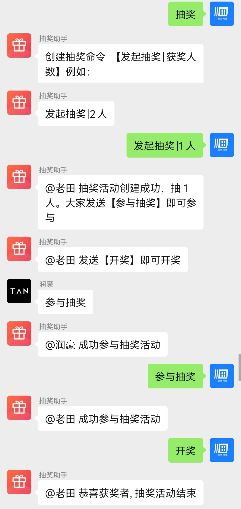

# luckybot
微信群抽奖机器人

源码代码一百来行，简单易懂，机器人具备自动通过好友， 通过入群， 入群话术。功能完备，简单的防封延时发送。

基于wechaty，机器人是个微TOKEN， 简单修改即可兼容企业微信。

# 安装部署
添加 .env 文件，并写入TOKEN
```
TOKEN=***
```

安装依赖并启动 
```
npm install && node bot.js
```

TOKEN 如何获取？ 
http://pad-local.com 注册即可获取7天试用

大家有其他免费token， 欢迎在issue中分享

# 机器人群指令一览

## 发起抽奖|*人
任何人都可在群上发起抽奖活动

## 参与抽奖
发起抽奖后，群里发送参与抽奖即可参加活动

## 开奖
从参与开奖的群友中， 选出*人并结束抽奖活动

## 结束抽奖[TODO]
群主强制结束活动

## 抽奖
发送抽奖活动指引

# 效果图如下：



# DEMO 机器人二维码


